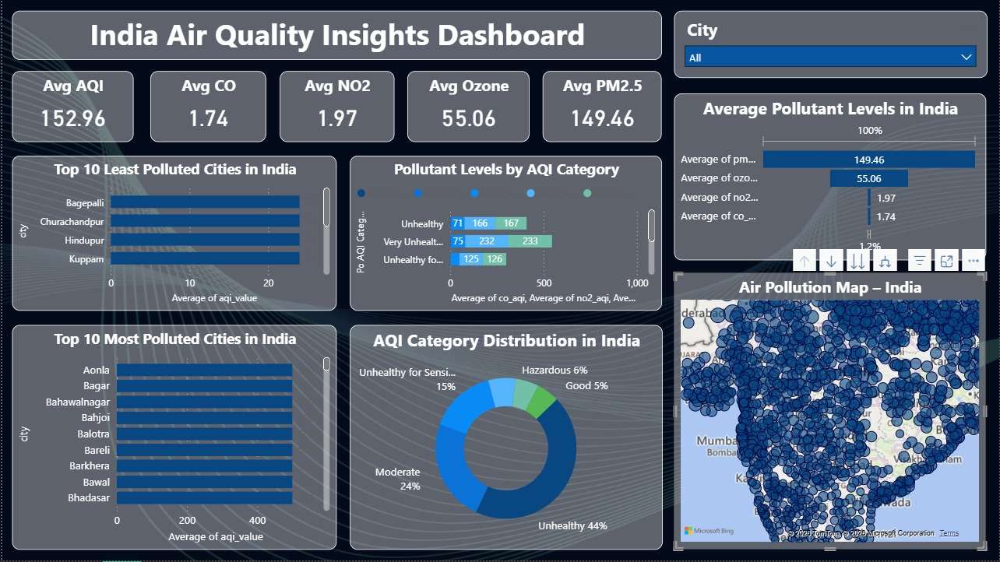
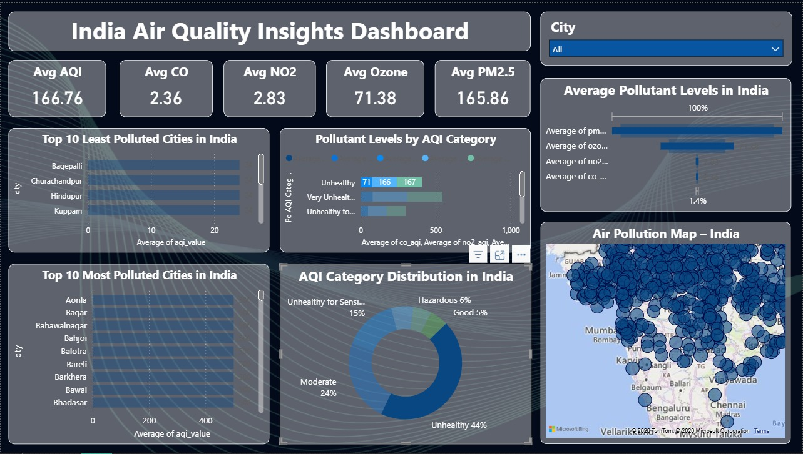
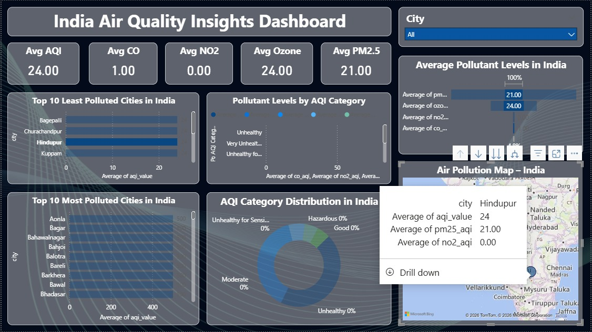

# 🇮🇳 India Air Quality Insights Dashboard

## 📊 Overview
This project presents an interactive Power BI dashboard analyzing air pollution trends across cities in India using AQI (Air Quality Index) data.

The goal is to identify pollution patterns, compare pollutant levels, and visualize geographical distribution for better understanding.

---

## 🔍 Key Features
- KPI cards showing average AQI and pollutant levels (CO, NO2, Ozone, PM2.5)
- Top 10 most and least polluted cities
- AQI category distribution
- Pollutant comparison across categories
- Interactive map visualization of pollution levels

---

## 📈 Key Insights
- A large number of cities fall under the **Unhealthy AQI category**
- **PM2.5 is the major contributor** to poor air quality
- Certain cities consistently rank among the most polluted
- Even less polluted cities mostly fall under **moderate AQI levels**
- Pollution levels vary significantly across regions

---

## 🛠 Tools & Technologies
- Power BI
- PostgreSQL
- Data Cleaning & Preprocessing

---

## 🖼 Dashboard Preview

### Full Dashboard

### KPI & Pollutant Analysis

### AQI Category Distribution

### Map Visualization

---

## 📂 Dataset
The dataset includes AQI values and pollutant levels (CO, NO2, Ozone, PM2.5) across multiple cities.

---

## 🚀 How to Use
1. Download the `.pbix` file from the `dashboard` folder
2. Open it using Power BI Desktop
3. Interact with filters and visuals to explore insights

---

## 💡 Future Improvements
- Add time-series analysis for trend tracking
- Integrate real-time AQI data
- Enhance geospatial accuracy with latitude & longitude

---

## 📌 Author
Shravani Kadam
